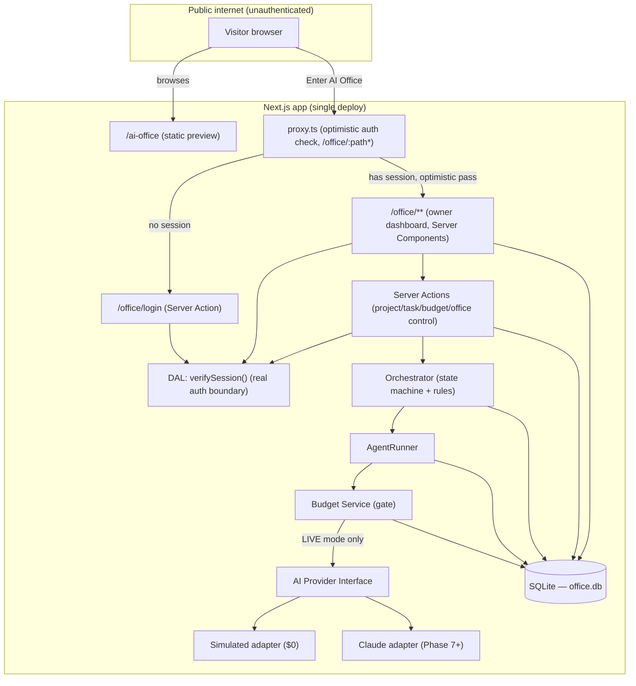
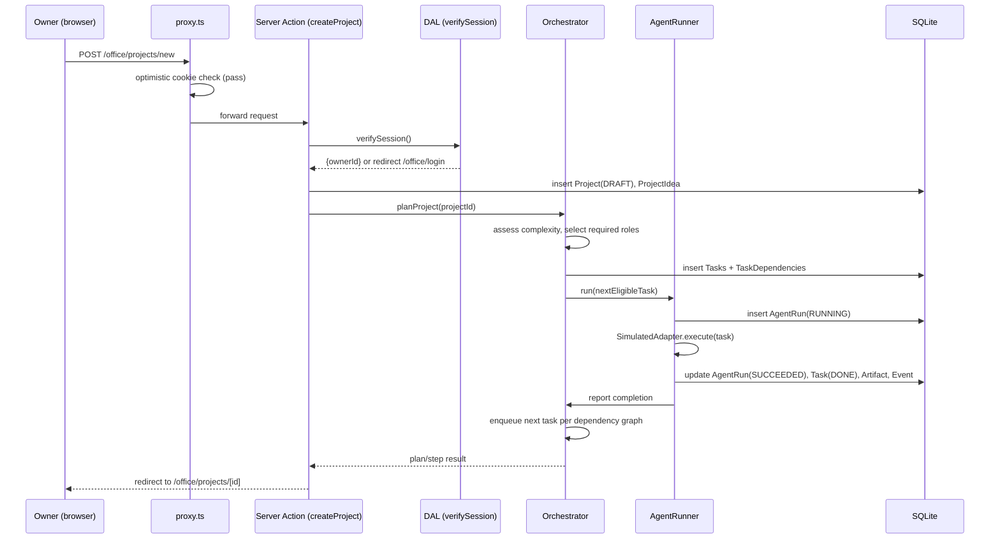

# 03 — System Architecture

## 1. Placement in the existing repository

AI Office lives inside this same Next.js app as new, additive route
segments and a new library namespace — no second app, no monorepo, no
separate deploy target.

```
app/
  ai-office/             NEW — public preview page (static)
    page.tsx
  office/                NEW — private, auth-gated workspace (route group)
    login/page.tsx        public (the login form itself)
    layout.tsx             enforces auth via DAL, renders shell nav
    page.tsx                dashboard
    projects/
      new/page.tsx
      [id]/page.tsx
    approvals/page.tsx
    budget/page.tsx
    audit/page.tsx
    actions/               Server Actions (auth, project, task, budget, office-control)
  api/
    office/                Route Handlers ONLY where a Server Action doesn't fit
      agent-runs/[id]/route.ts   (e.g. polling endpoint for run status, if needed)

lib/
  ai-office/               NEW — all Office logic, isolated from lib/data/**
    auth/                  session, DAL (verifySession), password hashing
    db/                    SQLite client, migrations, schema
    domain/                repositories: projects, tasks, agents, budget, ...
    orchestrator/          state machine + role-selection rules
    agents/                role catalog + AgentRunner
    providers/              AI provider adapter interface + Simulated + Claude adapters
    memory/                project-memory assembly (see 06-data-model.md §7)

proxy.ts                  NEW — single project-wide proxy, matcher: /office/:path*
```

This mirrors the existing `lib/data/**` repository/provider pattern
(`README.md` §Architecture) deliberately, so the codebase has one
consistent way of organizing a domain, not two competing ones.

## 2. High-level component diagram



## 3. Request flow — owner starts a project (simulated mode)



## 4. Layered architecture

```
┌─────────────────────────────────────────────────────────┐
│ Presentation:  app/ai-office/**, app/office/**            │  React Server/Client Components
├─────────────────────────────────────────────────────────┤
│ Application:   app/office/actions/**                       │  Server Actions — one per user intent
├─────────────────────────────────────────────────────────┤
│ Domain:        lib/ai-office/orchestrator, agents, domain   │  State machine, business rules, no I/O framework coupling
├─────────────────────────────────────────────────────────┤
│ Providers:     lib/ai-office/providers/**                   │  AI Provider Interface + adapters (Simulated, Claude, future)
├─────────────────────────────────────────────────────────┤
│ Persistence:   lib/ai-office/db/**                           │  SQLite client + repositories
└─────────────────────────────────────────────────────────┘
```

Rule: presentation code never talks to the database or a provider
directly — always through Server Actions → domain services → repositories.
This is the same discipline the existing `lib/data/index.ts` "only module
pages import from" rule already enforces for content, applied to the new
domain.

## 5. AI Provider abstraction (conceptual — detailed in 04-agent-architecture.md)

```
AIProviderAdapter (interface)
  runAgentTask(input: AgentTaskInput): Promise<AgentTaskResult>
  estimateCost(input): CostEstimate
  name: "simulated" | "claude" | ...

├── SimulatedAdapter    — deterministic fixture responses, $0, always available
├── ClaudeAdapter        — Phase 7+, wraps the Claude API, requires ANTHROPIC_API_KEY
└── (future) OpenAIAdapter, etc. — same interface, added without touching Orchestrator/AgentRunner
```

The Orchestrator and AgentRunner depend only on `AIProviderAdapter`, never
on a concrete provider. Swapping or adding a provider is a
`lib/ai-office/providers/index.ts` change, exactly like the existing
content provider swap pattern in `lib/data/providers/index.ts`.

## 6. Office open/closed as a system-wide gate

`OfficeStatus` is a singleton row read by:
- Every Server Action that would create/advance an agent run — refuses
  with a clear error if `CLOSED`.
- The Orchestrator's task-dispatch loop — never dispatches while
  `CLOSED`.
- The dashboard UI — shows the state prominently and disables
  "Start New Project" / resume controls while `CLOSED`.

Because there is no background scheduler in Phases 0–6 (everything is
request-driven from the owner's browser), "stop scheduled AI work" is
trivially true until a scheduler exists (Phase 7+ candidate, see
[11-implementation-phases.md](./11-implementation-phases.md)); at that
point the scheduler must also check `OfficeStatus` before firing, which
is called out explicitly in that phase's tasks so it isn't forgotten.

## 7. Local-first deployment shape (current target)

```
localhost:3000
  ├── existing public portfolio (unchanged)
  ├── /ai-office (public, static)
  └── /office/** (owner-only, dynamic, backed by ./office.db)
```

No external services required to run any of this. `ANTHROPIC_API_KEY`
(Phase 7+) is the only external dependency ever introduced, and only for
LIVE mode — SIMULATED mode has zero external dependencies.

## 8. Why not a separate app/service

Considered and rejected: a standalone Node service for the Office
(e.g. a separate Express/Fastify app or a separate Next.js project).
Rejected because:
- It would duplicate the design system, theme, and build/deploy pipeline
  the brief explicitly says to avoid duplicating.
- It adds a second local process to run, contradicting "minimal or zero
  additional cost" and local-first simplicity for a single-user tool.
- Next.js Server Actions + Route Handlers are sufficient for the
  request/response and background-task shapes this system needs at this
  scale; nothing here requires a different runtime.
This can be revisited only if a genuine need appears (e.g. a long-running
worker process for live multi-agent runs that must outlive a single HTTP
request) — flagged as an open question in
[14-open-questions.md](./14-open-questions.md), not decided now.
