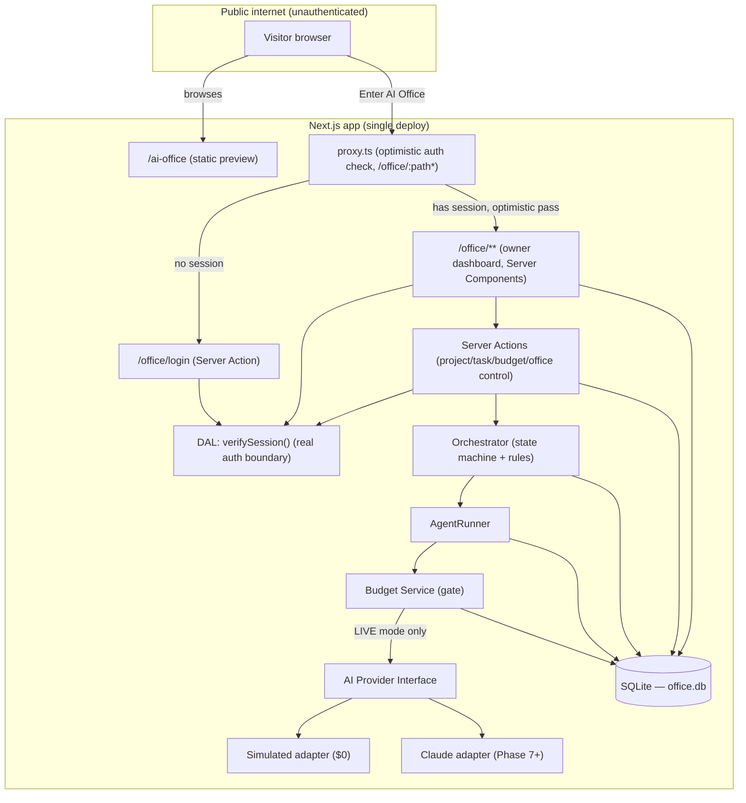
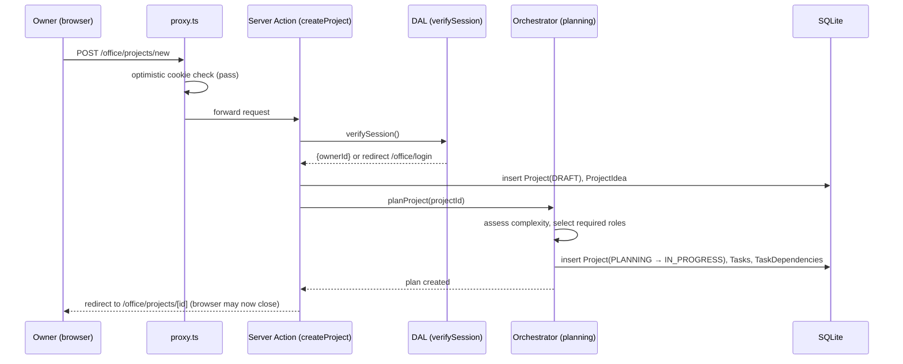
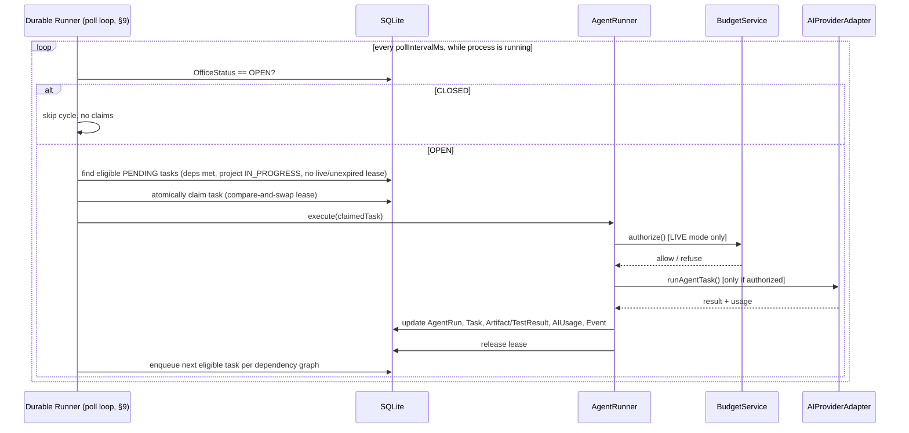

# 03 — System Architecture

## 1. Placement in the existing repository

AI Office lives inside this same Next.js app as new, additive route
segments and a new library namespace — no second app, no monorepo, no
separate deploy target.

```
app/
  ai-office/             NEW — public preview page (static)
    page.tsx
  office/                NEW — private, auth-gated workspace (route group)
    login/page.tsx        public (the login form itself)
    layout.tsx             enforces auth via DAL, renders shell nav
    page.tsx                dashboard
    projects/
      new/page.tsx
      [id]/page.tsx
    approvals/page.tsx
    budget/page.tsx
    audit/page.tsx
    actions/               Server Actions (auth, project, task, budget, office-control)
  api/
    office/                Route Handlers ONLY where a Server Action doesn't fit
      agent-runs/[id]/route.ts   (e.g. polling endpoint for run status, if needed)

lib/
  ai-office/               NEW — all Office logic, isolated from lib/data/**
    auth/                  session, DAL (verifySession), password hashing
    db/                    SQLite client, migrations, schema
    domain/                repositories: projects, tasks, agents, budget, ...
    orchestrator/          state machine + role-selection rules
    agents/                role catalog + AgentRunner
    providers/              AI provider adapter interface + Simulated + Claude adapters
    memory/                project-memory assembly (see 06-data-model.md §7)

proxy.ts                  NEW — single project-wide proxy, matcher: /office/:path*
```

This mirrors the existing `lib/data/**` repository/provider pattern
(`README.md` §Architecture) deliberately, so the codebase has one
consistent way of organizing a domain, not two competing ones.

## 2. High-level component diagram



## 3. Request flow — owner starts a project (simulated mode)

**Task creation and task execution are deliberately decoupled.** The
Server Action that handles "Start New Project" only plans the work
(creates the `Project`, `Tasks`, and `TaskDependencies` rows) and returns
immediately — it does **not** execute any task inline, and does not wait
for an agent run to finish. Execution is picked up asynchronously by the
**Durable Local Execution Runner** (§9), whether or not the owner's
browser is still connected. This is the mechanism that satisfies "the
workflow must not depend on keeping the `/office` browser page
continuously open."





This replaces the previous single-diagram model (where the Orchestrator
invoked `AgentRunner` synchronously inside the same request that created
the project) with the two-step model above: **plan synchronously,
execute asynchronously and durably.**

## 4. Layered architecture

```
┌─────────────────────────────────────────────────────────┐
│ Presentation:  app/ai-office/**, app/office/**            │  React Server/Client Components
├─────────────────────────────────────────────────────────┤
│ Application:   app/office/actions/**                       │  Server Actions — one per user intent
├─────────────────────────────────────────────────────────┤
│ Domain:        lib/ai-office/orchestrator, agents, domain   │  State machine, business rules, no I/O framework coupling
├─────────────────────────────────────────────────────────┤
│ Providers:     lib/ai-office/providers/**                   │  AI Provider Interface + adapters (Simulated, Claude, future)
├─────────────────────────────────────────────────────────┤
│ Persistence:   lib/ai-office/db/**                           │  SQLite client + repositories
└─────────────────────────────────────────────────────────┘
```

Rule: presentation code never talks to the database or a provider
directly — always through Server Actions → domain services → repositories.
This is the same discipline the existing `lib/data/index.ts` "only module
pages import from" rule already enforces for content, applied to the new
domain.

## 5. AI Provider abstraction (conceptual — detailed in 04-agent-architecture.md)

```
AIProviderAdapter (interface)
  runAgentTask(input: AgentTaskInput): Promise<AgentTaskResult>
  estimateCost(input): CostEstimate
  name: "simulated" | "claude" | ...

├── SimulatedAdapter    — deterministic fixture responses, $0, always available
├── ClaudeAdapter        — Phase 7+, wraps the Claude API, requires ANTHROPIC_API_KEY
└── (future) OpenAIAdapter, etc. — same interface, added without touching Orchestrator/AgentRunner
```

The Orchestrator and AgentRunner depend only on `AIProviderAdapter`, never
on a concrete provider. Swapping or adding a provider is a
`lib/ai-office/providers/index.ts` change, exactly like the existing
content provider swap pattern in `lib/data/providers/index.ts`.

## 6. Office open/closed as a system-wide gate

`OfficeStatus` is a singleton row read by:
- Every Server Action that would create a new project/task plan —
  refuses with a clear error if `CLOSED` (planning is still blocked when
  closed, even though planning itself doesn't spend anything, to keep
  the "closed means nothing moves" mental model simple and absolute).
- The Durable Runner's poll loop (§9) — checked at the top of every
  cycle; while `CLOSED`, the loop claims nothing, office-wide, for every
  project, immediately (within one poll interval, see §9.5).
- The dashboard UI — shows the state prominently and disables
  "Start New Project" / resume controls while `CLOSED`.

Unlike the earlier draft of this document, a lightweight local
background process (the Durable Runner) exists starting in **Phase 5**,
not Phase 7 — see §9 for exactly what it is and why it still adds zero
infrastructure cost. `OfficeStatus` being `CLOSED` is what keeps that
process idle rather than what keeps it from existing.

## 7. Local-first deployment shape (current target)

```
localhost:3000
  ├── existing public portfolio (unchanged)
  ├── /ai-office (public, static)
  └── /office/** (owner-only, dynamic, backed by ./office.db)
```

No external services required to run any of this. `ANTHROPIC_API_KEY`
(Phase 7+) is the only external dependency ever introduced, and only for
LIVE mode — SIMULATED mode has zero external dependencies.

## 8. Why not a separate app/service

Considered and rejected: a standalone **infrastructure** service for the
Office — a separate Express/Fastify app, a hosted queue (SQS/Redis/
RabbitMQ), or an orchestration platform (Kubernetes, a cloud job
scheduler). Rejected because:
- It would duplicate the design system, theme, and build/deploy pipeline
  the brief explicitly says to avoid duplicating.
- It adds real infrastructure and often real recurring cost, contradicting
  "minimal or zero additional cost" and local-first simplicity for a
  single-user tool.
- SQLite's own concurrency model (§9.3) already provides the mutual-
  exclusion guarantee a message queue or distributed lock would exist to
  provide — introducing one would be solving an already-solved problem
  with a heavier tool.

This is a different question from "does *some* process need to keep
running to advance work without the browser open" — the answer to that
one is yes, and §9 describes it. The Durable Runner is not the rejected
"separate service": it is either code that runs inside the same Next.js
server process, or at most a small companion Node script sharing this
same repository, the same SQLite file, and the same domain code — no new
infrastructure, no new network hop, no new deploy target.

## 9. Durable Local Execution Runner

### 9.1 What problem this solves

Without this, the original design (§3, prior revision) only ever
advanced a task while a Server Action was actively handling a request —
in practice, only while the owner had `/office` open and was interacting
with it. The brief is explicit that this is wrong: once an idea is
submitted, agents should keep working through the plan until they hit
completion, an approval gate, a budget stop, an unrecoverable error, or
an explicit escalation condition — **not** until the owner closes their
laptop lid.

### 9.2 What it is (and isn't)

The Durable Runner is a **local, in-process (or same-machine companion-
process) poll loop** that claims and executes eligible tasks on a fixed
interval, for as long as the Node process serving this app is running.
It is:

- **Not** a hosted queue, not Redis, not a message broker, not
  Kubernetes, not a paid scheduler service.
- **Not** guaranteed to run 24/7 independent of the developer's machine
  — if the process isn't running, work simply doesn't advance, and
  **resumes automatically the next time the process starts** (§9.6).
  That is the honest, correctly-scoped meaning of "local-first" durability
  here: durable *state* (nothing is lost), not durable *uptime* (the
  process itself isn't kept alive by this system — see §9.8 for what
  would change that).
- A single logical loop, regardless of implementation shape (§9.7):
  read eligible work → atomically claim → execute → persist result →
  repeat.

### 9.3 Why SQLite alone is enough for the lock (no Redis needed)

SQLite serializes all writes to a single file through one active writer
at a time. A task claim is therefore a single atomic statement:

```sql
UPDATE tasks
SET leaseOwnerId = :runnerId, leaseExpiresAt = :now + :leaseDurationMs
WHERE id = :taskId
  AND status = 'PENDING'
  AND (leaseExpiresAt IS NULL OR leaseExpiresAt < :now);
```

If the statement affects zero rows, another runner instance (or a
previous, still-valid lease) already holds the claim — this instance
moves on to the next candidate. This is the entire "one active execution
lease/lock prevents duplicate execution of the same task" requirement,
satisfied by SQLite's existing transaction guarantees — no distributed
lock service required. This is also why the requirement "no Redis, no
paid queues" is not a constraint the design has to work around; it's a
constraint the design doesn't need to violate in the first place.

### 9.4 Data model additions (detailed in 06-data-model.md §8)

- `tasks.leaseOwnerId` (TEXT, nullable) — an id generated once per
  runner process start.
- `tasks.leaseExpiresAt` (INTEGER, nullable) — the claim above sets this
  to "now + a max execution duration"; a task whose lease has expired
  without completing is, by definition, eligible to be reclaimed.
- `tasks.attemptCount` (already existed, see
  [06-data-model.md](./06-data-model.md) §2) — a crash-interrupted
  attempt still counts toward `role.maxRetries` when it's reclaimed
  (§9.6), which is what prevents a crash from resetting retry
  accounting into an effectively infinite retry loop.

### 9.5 Office Close / Project Pause interaction

Every poll cycle re-reads `OfficeStatus` and each candidate task's
project status **fresh** — it never caches "the Office was open a minute
ago." So:
- `CLOSE OFFICE` takes effect on the **next poll cycle** (bounded by the
  poll interval, default 5s — see §9.7) for every project, with no new
  claims made; this is "immediately prevents new work from starting" at
  the granularity a local polling design can honestly promise 
  (sub-second reaction is not a real requirement for a personal tool
  reviewing its own AI agents — see
  [14-open-questions.md](./14-open-questions.md) if this default ever
  needs tightening).
- `PAUSE PROJECT` removes that project's tasks from the eligible-task
  query for every subsequent cycle — its tasks stay `PENDING`,
  untouched, until `RESUME PROJECT` makes them eligible again. Other
  projects are unaffected.
- A task already claimed and mid-execution when a Close/Pause happens is
  allowed to finish that one attempt (near-instant for `SimulatedAdapter`,
  bounded by the max-duration timeout for a live adapter, §9.6) — it is
  not force-killed mid-call, but no *new* claim happens after it.

### 9.6 No uncontrolled infinite loops / crash recovery

Two independent bounds prevent runaway execution:

1. **Per-attempt timeout.** Every claim sets `leaseExpiresAt` to a fixed
   ceiling (e.g. a generous default of 5 minutes — tunable, not a hard
   architectural number). If `AgentRunner` hasn't recorded a result by
   then, the attempt is treated as `FAILED` (reason: `timeout`) and
   follows the normal retry/escalation path in
   [04-agent-architecture.md](./04-agent-architecture.md) §6 — never an
   unbounded wait.
2. **Per-task retry ceiling.** `role.maxRetries` (existing, §ibid.)
   still applies regardless of *why* an attempt failed — timeout,
   adapter error, or a crash-recovered stale lease all increment the
   same `attemptCount`. Exhausting retries escalates instead of looping.

**Crash recovery**: on process start, before the poll loop's first
cycle, the runner sweeps for tasks whose `leaseExpiresAt` has already
passed — these are attempts that were interrupted by a crash/kill rather
than completing normally. Each is reset to `PENDING` (lease cleared,
`attemptCount` **already incremented** for that interrupted attempt, so
it counts toward the ceiling above) and a `messages_events` row
(`type: "task.recovered_after_crash"`) is written — this is the
mechanism behind "crashes must leave tasks recoverable rather than
silently lost," and it is provably bounded because it shares the same
retry ceiling as any other failure, not a separate unlimited-recovery
path.

### 9.7 Implementation shape (two viable options — a Phase 5 decision, not fixed here)

**Option A — in-process singleton (recommended default).** The poll
loop starts once when the Next.js server process boots, using the
`instrumentation.ts` convention (a documented Next.js file convention
for running setup code once per server instance) guarded by a
module-level singleton so Next's dev-mode hot-reload can't accidentally
start a second concurrent loop. Simplest developer experience — `npm run
dev`/`npm run start` is the only command needed; the app and the runner
are one process. **Must be verified against
`node_modules/next/dist/docs/`** at implementation time (per
`AGENTS.md`) — the exact convention/API may have moved since this
package was written, same caveat already applied to the auth pattern in
[08-security-plan.md](./08-security-plan.md) §2.

**Option B — standalone companion script.** A small
`lib/ai-office/runner/start.ts`, run as a second local process
(`npm run office:runner`) alongside `next dev`/`next start`, sharing the
same SQLite file and domain code. More explicit about the process
boundary, immune to any dev-server hot-reload edge case, at the cost of
"two commands to run the app" instead of one.

Either way: the loop body is a single pure function (`runOneCycle()`)
that does one claim-and-execute pass and returns — the `setInterval`/
timer wrapper around it is a thin shell. This matters for testability
(§10-testing-strategy.md §2.14): automated tests call `runOneCycle()`
directly, repeatedly, until no eligible work remains, rather than
sleeping through real poll intervals.

### 9.8 How this could evolve if deployment requirements change

Everything above is scoped to "one owner, one machine, zero added
infrastructure." If a future deployment (Phase 10, optional, see
[11-implementation-phases.md](./11-implementation-phases.md)) needs the
Office to keep working even when no developer machine is on:

- The same `runOneCycle()` function is already infrastructure-agnostic —
  it only depends on the SQLite repositories, not on being invoked by a
  specific process shape. Swapping the *trigger* (a hosted cron, a
  managed background-worker platform) without touching the claim/
  execute/lease logic is the expected evolution path, not a rewrite.
- SQLite's single-writer model stops being sufficient the moment more
  than one machine needs to share the same database — that would be the
  actual trigger for considering a hosted database and, only then, a
  real queue/lock service. Not a decision to make now, and explicitly
  not implied by anything in Phases 0–9.
