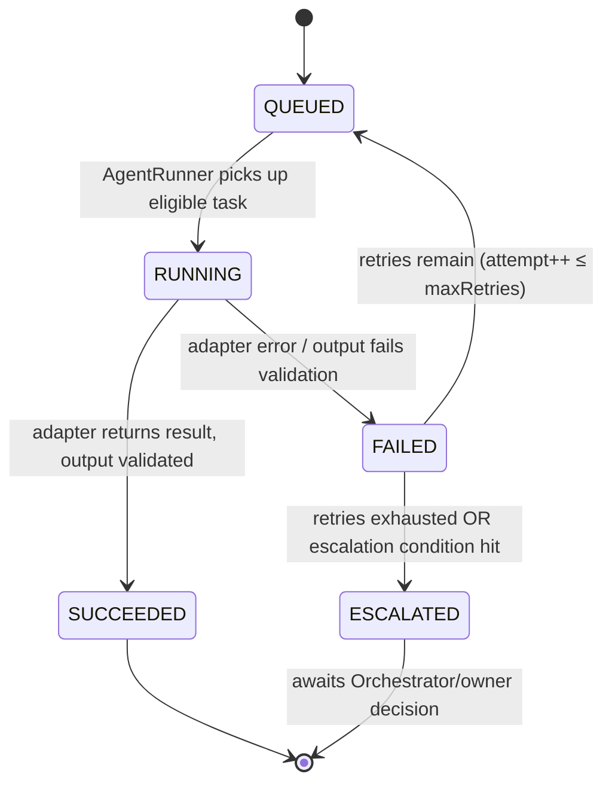

# 04 — Agent Architecture

## 1. Agent role catalog (static, seeded, not user-editable at runtime)

Each role is a row in the `agent_roles` table (schema in
[06-data-model.md](./06-data-model.md) §2) with a fixed contract. The
Orchestrator selects a **subset** per project — never assumes all roles
are needed.

| Role | Responsibility | Typical inputs | Typical outputs |
|---|---|---|---|
| Chief of Staff / Orchestrator | Interpret idea, assess complexity, select roles, build task plan, track dependencies, enforce gates | Project idea, project memory | Task plan, role selection, decisions |
| Product Owner | Turn idea into requirements, record assumptions as decisions | Idea, clarifying context | Requirements doc (artifact), decisions |
| Research Agent | Feasibility/prior-art research when the idea is ambiguous or novel | Requirements | Research notes (artifact) |
| Solution Architect | Propose architecture, data model, tech choices | Requirements, research | Architecture doc (artifact), decisions |
| UI/UX Agent | Propose UX flows/screens | Requirements, architecture | UX spec (artifact) |
| Frontend Developer | Implement UI per architecture/UX spec | Architecture, UX spec, task | Code artifact, task status |
| Backend Developer | Implement server/data logic | Architecture, task | Code artifact, task status |
| QA/Test Agent | Verify Definition of Done, write/run tests | Code artifacts, requirements | Test results, pass/fail, failure records |
| Security Reviewer | Check for security-sensitive issues | Code artifacts | Findings (artifact), pass/fail |
| Code Reviewer | Review code quality/consistency | Code artifacts | Review notes (artifact), pass/fail |
| Release Agent | Prepare final package for owner approval | All prior artifacts | Release summary (artifact) |

Not every project uses every role — e.g. a trivial script idea may skip
UI/UX and Frontend entirely; the Orchestrator's role-selection rules are
defined in [05-orchestration-workflow.md](./05-orchestration-workflow.md)
§2.

## 2. Agent contract (applies to every role)

```ts
interface AgentRoleDefinition {
  id: string                    // "qa-agent", "solution-architect", ...
  name: string
  responsibilities: string[]
  allowedInputs: ContextScope[]  // what project memory this role may read
  allowedOutputs: ArtifactType[] // what it's permitted to produce
  permittedActions: ActionScope[] // e.g. "write-artifact", "run-tests" — NEVER "deploy", "spend-budget-above-cap", "delete-repo"
  maxRetries: number             // per-task retry ceiling before escalation
  escalatesTo: "orchestrator" | "owner"
}
```

- **Limited permissions**: an agent's `permittedActions` is an allowlist,
  not a denylist — anything not explicitly granted is refused. No agent
  role is ever granted `deploy-production`, `purchase`, or
  `delete-destructive` — those are owner-only actions, never delegated
  (see [08-security-plan.md](./08-security-plan.md) §Owner Approval).
- **Scoped context**: an agent receives only the slice of
  [project memory](./06-data-model.md) §7 relevant to its task (e.g. QA
  gets requirements + the specific code artifact under test, not the
  entire conversation history of every other agent) — both a cost control
  and a correctness control (less irrelevant context to confuse output).
- **Task status**, **retry limits**, **escalation rules**, and **audit
  history** are properties of the `Task`/`TaskAttempt`/`AgentRun` records
  (see [06-data-model.md](./06-data-model.md) §2), not the role
  definition — the role defines the *ceiling* (`maxRetries`), the task
  instance tracks the *actual* count.

## 3. Agent run lifecycle



Every transition writes an `Event` row (see
[06-data-model.md](./06-data-model.md) §2) — this **is** the audit
history requirement; there is no separate logging system to keep in
sync.

## 4. AI Provider Interface

```ts
interface AIProviderAdapter {
  readonly name: string                 // "simulated" | "claude" | ...
  runAgentTask(input: AgentTaskInput): Promise<AgentTaskResult>
  estimateCost(input: AgentTaskInput): CostEstimate  // tokens/$ estimate before running
}

interface AgentTaskInput {
  role: AgentRoleId
  task: TaskContext          // scoped project memory slice, not the whole project
  instructions: string        // role+task-specific system/task prompt
}

interface AgentTaskResult {
  output: ArtifactPayload | TestResultPayload | DecisionPayload
  status: "SUCCEEDED" | "FAILED"
  usage: { inputTokens: number; outputTokens: number; costUsd: number }
  raw?: unknown                // provider-specific raw response, for debugging only
}
```

```
AI Provider Interface
├── SimulatedAdapter   (Phase 4+) — deterministic fixture library keyed by role+task-shape, costUsd always 0
├── ClaudeAdapter        (Phase 7+) — calls the Claude API, requires ANTHROPIC_API_KEY, real costUsd from usage
└── (future) OpenAIAdapter, etc.  — same interface; adding one never touches Orchestrator/AgentRunner code
```

No provider is integrated in this planning task. The interface above is
the contract Phase 4 (simulated) and Phase 7 (Claude) both implement
identically, which is what makes "swap providers without redesigning the
app" true rather than aspirational.

## 5. AgentRunner responsibilities

- Pulls the next eligible `Task` per the Orchestrator's dependency graph.
- Builds the scoped `AgentTaskInput` from project memory (§ above).
- Checks `OfficeStatus` (must be `OPEN`) and, for LIVE mode, checks the
  Budget Service gate (see
  [09-budget-and-cost-controls.md](./09-budget-and-cost-controls.md))
  **before** invoking the adapter.
- Invokes the current `AIProviderAdapter` for the role.
- Validates the result shape against the role's `allowedOutputs`.
- Writes `AgentRun`, `TaskAttempt`, `Artifact`/`TestResult`/`Decision`,
  `AIUsage`, and `Event` rows.
- On failure: increments attempt count, re-queues if under
  `maxRetries`, otherwise escalates per §6.
- Never calls a provider adapter for a destructive/paid/production action
  directly — those aren't in any role's `permittedActions`, so this is
  structurally impossible, not just policy.

## 6. Escalation conditions (agent → Orchestrator → owner)

An agent run escalates (stops retrying, surfaces to the owner as a
pending `Approval` or a flagged item on the dashboard) when any of:

1. Repeated failure — `attempt count > role.maxRetries`.
2. Conflicting requirements — two agents' outputs contradict each other
   in a way the Orchestrator's rules can't auto-resolve (e.g. Architect
   and Product Owner disagree on a hard constraint).
3. Destructive operation requested by an agent's output (e.g. a "drop
   table" suggestion) — never auto-executed, always escalated.
4. Paid infrastructure required (an agent's plan calls for a service with
   a cost) — escalated before any such step is taken.
5. Production change required — always escalated; agents only ever
   target the project's own sandboxed workspace, never this portfolio
   repo's `master` or any deployed target.
6. Security-sensitive operation (credentials, auth, PII handling) flagged
   by the Security Reviewer role.
7. Budget threshold reached (see
   [09-budget-and-cost-controls.md](./09-budget-and-cost-controls.md)).
8. Unresolved architectural decision the Orchestrator's rules have no
   default for.

Escalation conditions are enforced in the Orchestrator/AgentRunner layer
(code), not left to an agent's own judgment — an LLM-backed agent
deciding "this seems fine to auto-approve" is exactly the failure mode
this list exists to prevent.

## 7. Simulated vs. Live mode

A project (and the Office globally) has an `aiMode`: `SIMULATED` | `LIVE`.

- **SIMULATED**: `AgentRunner` always uses `SimulatedAdapter`. Used for
  all of Phase 4–6 development and testing, and afterward whenever
  Raviteja wants to test a workflow change at zero cost.
- **LIVE**: `AgentRunner` uses the configured real adapter (Claude,
  Phase 7+), subject to the Budget Service gate on every call.

Mode is a per-project setting with an Office-level default, so Raviteja
can dry-run a new idea in SIMULATED mode before committing budget to a
LIVE run — this is the mechanism, not just a nice-to-have, that makes
"test the whole workflow before spending API money" true end to end.
