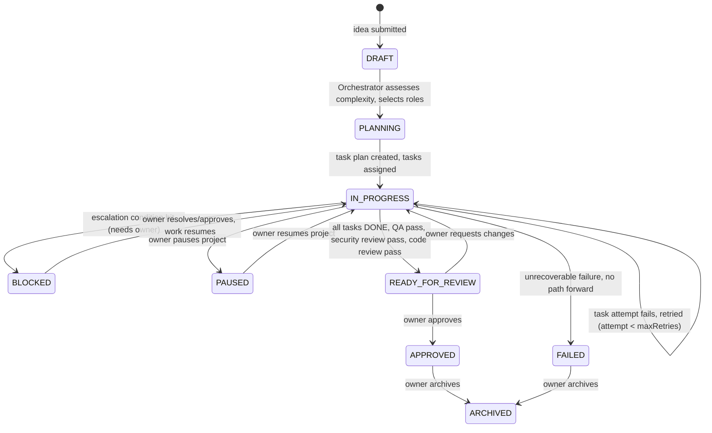
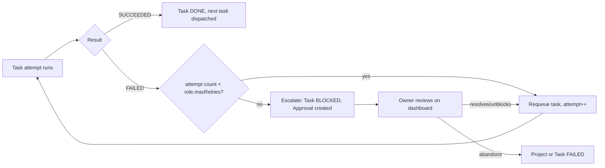

# 05 — Orchestration & Workflow

## 1. Orchestrator implementation approach

The Orchestrator is a **deterministic state machine + rule engine**
(plain TypeScript, no LLM call) for Phases 4–6. This is what lets the
entire workflow — idea → plan → tasks → execution → QA failure → retry →
pass → review → approval — be built and tested with zero AI spend. In
Phase 7+, one specific step (role/complexity assessment, §2 below) *may*
optionally be upgraded to use a LIVE agent call for better judgment on
ambiguous ideas — this is an additive enhancement behind the same
interface, not a rewrite, and is listed as an open question in
[14-open-questions.md](./14-open-questions.md) rather than committed to
now.

## 2. Complexity assessment & role selection (rule-based, Phase 4–6)

Input: the raw idea text + any recorded assumptions.

Heuristics (simple, transparent, tunable — not a black box):

| Signal | Effect |
|---|---|
| Idea mentions a UI/screens/visual output | include UI/UX Agent, Frontend Developer |
| Idea mentions data persistence/API/backend logic | include Backend Developer |
| Idea is a single deterministic script/CLI with no UI | skip UI/UX Agent, Frontend Developer |
| Idea's scope is ambiguous or references unfamiliar domain/prior art | include Research Agent |
| Any code will be produced | always include QA/Test Agent, Code Reviewer |
| Code touches auth, payments, PII, external network calls | always include Security Reviewer |
| Project ready for owner review | always include Release Agent |
| Any project at all | always include Product Owner (requirements) and Chief of Staff (implicit — it's the Orchestrator itself) |

This table is the literal contents of the Phase 5 rule engine — an
implementer should not need to invent scoring logic, only encode this
table and extend it as real usage reveals gaps.

## 3. End-to-end workflow (matches the brief's required test sequence)



### 3.1 The brief's specific required simulated sequence, mapped to this model

```
Idea submitted            → ProjectIdea created, Project(DRAFT)
→ Project created          → Project(PLANNING)
→ Product task created     → Task(role=product-owner, PENDING)
→ Architecture task created → Task(role=solution-architect, PENDING, dependsOn=product task)
→ Developer task created    → Task(role=backend/frontend-developer, PENDING, dependsOn=architecture task)
→ QA task created           → Task(role=qa-agent, PENDING, dependsOn=developer task)
→ QA failure                → TaskAttempt(FAILED) on QA task, Failure record, Developer task re-opened
→ Task returned to Developer → Task(role=developer, back to IN_PROGRESS), dependency edge preserved
→ Fix submitted              → new TaskAttempt on developer task, Artifact updated
→ QA pass                    → Task(role=qa-agent, DONE), TestResult(PASS)
→ Security review            → Task(role=security-reviewer, PENDING → DONE)
→ Final approval              → Project(READY_FOR_REVIEW) → owner action → Project(APPROVED)
```

This exact sequence is the Phase 4 acceptance scenario (see
[11-implementation-phases.md](./11-implementation-phases.md)) — it must
run to completion using `SimulatedAdapter` with $0 spend before any live
provider work begins.

## 4. Task dependency management

- Tasks form a DAG per project (`task_dependencies` table, see
  [06-data-model.md](./06-data-model.md) §2).
- **Planning vs. dispatch are two different moments.** The Orchestrator
  builds the DAG synchronously when a project is created (or when an
  escalation is resolved and work resumes) — this is a normal Server
  Action, done and returned within the request. *Dispatch* — finding all
  tasks in `PENDING` whose dependencies are all `DONE`, whose project is
  `IN_PROGRESS` (not `PAUSED`/`BLOCKED`), and whose Office is `OPEN`, then
  claiming and executing one — is performed by the **Durable Local
  Execution Runner**'s poll loop
  ([03-system-architecture.md](./03-system-architecture.md) §9), running
  independently of any browser session. This is what makes "the
  workflow must not depend on keeping `/office` open" true: the DAG,
  once planned, keeps advancing on its own as long as the runner's
  process is running.
- No parallel execution ambiguity is needed at this scale (single user,
  modest task graphs) — simple topological dispatch, one claim per poll
  cycle (or a small batch), is sufficient; true concurrent multi-agent
  execution is a later optimization, not a Phase 4–6 requirement.
- A failed task returns to its owning role (not to a different role) —
  QA failure re-opens the *developer* task that produced the artifact
  under test, per §3.1, not the QA task itself. Re-opening a task simply
  sets it back to `PENDING` with its dependency edges intact, so the
  next poll cycle picks it up the same way any other eligible task would
  — no special-cased "retry" code path distinct from ordinary dispatch.

## 5. Quality gates (must pass before `READY_FOR_REVIEW`)

1. All tasks in the plan are `DONE`.
2. Latest QA `TestResult` for the project is `PASS`.
3. Security Reviewer task is `DONE` with no unresolved `HIGH`-severity
   finding (unresolved high-severity findings escalate instead of
   silently passing).
4. Code Reviewer task is `DONE`.
5. No unresolved `Approval` of type `blocking` outstanding.

Definition of Done for the *project itself* is these five conditions —
see [12-definition-of-done.md](./12-definition-of-done.md) for the
authoritative, single-source checklist (this section must stay in sync
with that document; that document is the one to update first if the
gates ever change).

## 6. Retry & escalation flow



## 7. Avoiding unnecessary clarification (brief requirement)

Per the brief: "avoid unnecessary clarification if safe assumptions can
be recorded." Rule: the Product Owner role records an explicit
`ProjectDecision` (type `assumption`) for anything it infers instead of
asking, unless the missing information is one of:
- A budget-relevant choice (e.g. "should this call a paid API") — always
  escalates, never assumed.
- A destructive/irreversible choice — always escalates.
- Something with no reasonable safe default (e.g. target audience for a
  design choice with real UX consequences) — escalates as a `question`
  type item on the owner's Approvals queue, distinct from a blocking
  approval, so the owner can answer without it counting as a workflow
  failure.

## 8. Owner control actions and their workflow effect

| Action | Effect |
|---|---|
| OPEN OFFICE | `OfficeStatus.state = OPEN`; the Durable Runner's poll loop resumes claiming for all non-paused projects on its next cycle |
| CLOSE OFFICE | `OfficeStatus.state = CLOSED`; no new `AgentRun` is started anywhere; in-flight SIMULATED runs (near-instant) may finish, in-flight LIVE runs are not started in the first place because the gate is checked before invocation, not mid-call |
| PAUSE PROJECT | `Project.status = PAUSED`; the Durable Runner's eligibility query excludes its tasks; state fully preserved |
| RESUME PROJECT | `Project.status` returns to `IN_PROGRESS`; the Durable Runner picks dispatch back up exactly where the dependency graph left off on its next cycle — no re-planning, no lost work |

No agent role ever calls these controls itself — they are owner-only
Server Actions (see [08-security-plan.md](./08-security-plan.md)). See
[03-system-architecture.md](./03-system-architecture.md) §9.5 for the
exact poll-cycle-level mechanics behind this table.
