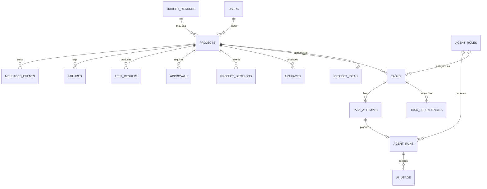

# 06 — Data Model

## 1. Storage choice: SQLite

**Recommended default: SQLite**, one local file (e.g. `office.db` at the
repo root or `.data/office.db`), for local development and for a
single-owner tool indefinitely — there is no multi-instance/concurrent-
writer requirement here that would justify a client-server database.

Two implementation paths, left as an explicit choice for whoever
implements Phase 3 (not decided here — see
[14-open-questions.md](./14-open-questions.md)):

- **`better-sqlite3`** — synchronous, mature, the most common choice in
  the Next.js ecosystem; requires a native module (new dependency,
  documented per the dependency policy in
  [00-master-plan.md](./00-master-plan.md)).
- **`node:sqlite`** — built into Node.js (stable in current LTS lines at
  time of writing, was experimental in Node 22), zero new dependency, but
  requires confirming the project's actual local Node version supports it
  (README currently states "Node.js 20+," which predates `node:sqlite`
  stabilizing — this must be verified against the developer's real `node
  --version` before committing to it, not assumed).

Either choice keeps the DB file **already gitignored** — `.gitignore`
has a `*.sqlite`/`*.db` pattern already present, so no `.gitignore`
change is needed for the database file itself.

## 2. Tables

All tables use `TEXT` primary keys (UUIDs) except where noted, and
`createdAt`/`updatedAt` (`INTEGER`, unix ms) on every table — omitted
below for brevity except where a table has other timestamp fields worth
calling out.

### `users`
Single-owner table — in practice always exactly one row.
| Column | Type | Notes |
|---|---|---|
| id | TEXT PK | |
| email | TEXT | owner's login identity |
| passwordHash | TEXT | bcrypt/argon2 hash — never plaintext |
| role | TEXT | always `"owner"` — kept as a column, not hardcoded, so a future second role doesn't need a migration |

### `office_status`
Singleton row (`id = "singleton"`).
| Column | Type |
|---|---|
| id | TEXT PK |
| state | TEXT — `OPEN` \| `CLOSED` |
| changedAt | INTEGER |
| changedBy | TEXT (FK users.id) |
| reason | TEXT nullable |

### `projects`
| Column | Type |
|---|---|
| id | TEXT PK |
| title | TEXT |
| status | TEXT — `DRAFT`\|`PLANNING`\|`IN_PROGRESS`\|`BLOCKED`\|`PAUSED`\|`READY_FOR_REVIEW`\|`APPROVED`\|`FAILED`\|`ARCHIVED` |
| aiMode | TEXT — `SIMULATED`\|`LIVE` |
| monthlyBudgetCapUsd | REAL nullable | overrides office default if set |
| ownerId | TEXT (FK users.id) |

### `project_ideas`
| Column | Type |
|---|---|
| id | TEXT PK |
| projectId | TEXT (FK projects.id) |
| rawText | TEXT | the original one-sentence (or longer) input |
| submittedAt | INTEGER |

### `agent_roles`
Seeded catalog (§ role list in
[04-agent-architecture.md](./04-agent-architecture.md) §1) — not created
by users.
| Column | Type |
|---|---|
| id | TEXT PK | e.g. `"qa-agent"` |
| name | TEXT |
| responsibilities | TEXT (JSON array) |
| allowedInputs | TEXT (JSON array of context-scope tags) |
| allowedOutputs | TEXT (JSON array of artifact types) |
| permittedActions | TEXT (JSON array) |
| maxRetries | INTEGER |
| escalatesTo | TEXT — `orchestrator`\|`owner` |

### `tasks`
| Column | Type |
|---|---|
| id | TEXT PK |
| projectId | TEXT (FK projects.id) |
| roleId | TEXT (FK agent_roles.id) |
| title | TEXT |
| status | TEXT — `PENDING`\|`ASSIGNED`\|`IN_PROGRESS`\|`IN_REVIEW`\|`DONE`\|`FAILED`\|`BLOCKED` |
| attemptCount | INTEGER default 0 |

### `task_dependencies`
| Column | Type |
|---|---|
| id | TEXT PK |
| taskId | TEXT (FK tasks.id) | the dependent task |
| dependsOnTaskId | TEXT (FK tasks.id) | must be `DONE` first |

### `task_attempts`
One row per execution attempt of a task (retries create new rows, never
overwrite).
| Column | Type |
|---|---|
| id | TEXT PK |
| taskId | TEXT (FK tasks.id) |
| attemptNumber | INTEGER |
| status | TEXT — `RUNNING`\|`SUCCEEDED`\|`FAILED` |
| agentRunId | TEXT (FK agent_runs.id) nullable |

### `agent_runs`
The actual provider invocation record (simulated or live).
| Column | Type |
|---|---|
| id | TEXT PK |
| taskAttemptId | TEXT (FK task_attempts.id) |
| roleId | TEXT (FK agent_roles.id) |
| provider | TEXT — `"simulated"`\|`"claude"`\|... |
| status | TEXT — `QUEUED`\|`RUNNING`\|`SUCCEEDED`\|`FAILED`\|`ESCALATED` |
| startedAt | INTEGER |
| finishedAt | INTEGER nullable |

### `messages_events` (audit/activity trail — see §4)
| Column | Type |
|---|---|
| id | TEXT PK |
| projectId | TEXT (FK projects.id) nullable | nullable for office-level events |
| type | TEXT | e.g. `task.status_changed`, `agent_run.failed`, `office.closed` |
| payload | TEXT (JSON) |
| actor | TEXT | `"owner"`, a roleId, or `"system"` |
| occurredAt | INTEGER |

### `project_decisions`
Records both deliberate architecture/product decisions and recorded
assumptions (§ orchestration doc §7).
| Column | Type |
|---|---|
| id | TEXT PK |
| projectId | TEXT (FK projects.id) |
| type | TEXT — `decision`\|`assumption` |
| summary | TEXT |
| rationale | TEXT nullable |
| madeBy | TEXT | roleId or `"owner"` |

### `artifacts`
| Column | Type |
|---|---|
| id | TEXT PK |
| projectId | TEXT (FK projects.id) |
| taskId | TEXT (FK tasks.id) nullable |
| type | TEXT — `requirements`\|`architecture`\|`ux-spec`\|`code`\|`test-report`\|`security-report`\|`review-notes`\|`release-summary` |
| content | TEXT | markdown/JSON payload, or a path if externalized (§5) |
| version | INTEGER default 1 |

### `approvals`
| Column | Type |
|---|---|
| id | TEXT PK |
| projectId | TEXT (FK projects.id) nullable | nullable for office-level approvals (e.g. raise budget cap) |
| kind | TEXT — see full list in [08-security-plan.md](./08-security-plan.md) Owner Approval Gates |
| status | TEXT — `PENDING`\|`APPROVED`\|`REJECTED` |
| requestedBy | TEXT | roleId or `"system"` |
| context | TEXT (JSON) | enough detail to decide without leaving the page |
| decidedAt | INTEGER nullable |

### `budget_records`
| Column | Type |
|---|---|
| id | TEXT PK |
| scope | TEXT — `office`\|`project` |
| scopeId | TEXT nullable | projectId when scope=`project` |
| periodStart | INTEGER | start of the billing month |
| capUsd | REAL |
| warnAtPercent | INTEGER | e.g. 50, 80 |

### `ai_usage`
| Column | Type |
|---|---|
| id | TEXT PK |
| agentRunId | TEXT (FK agent_runs.id) |
| projectId | TEXT (FK projects.id) |
| provider | TEXT |
| inputTokens | INTEGER |
| outputTokens | INTEGER |
| costUsd | REAL | `0` for simulated runs, always logged for realism/testing |

### `test_results`
| Column | Type |
|---|---|
| id | TEXT PK |
| projectId | TEXT (FK projects.id) |
| taskId | TEXT (FK tasks.id) |
| status | TEXT — `PASS`\|`FAIL` |
| summary | TEXT |
| details | TEXT (JSON) nullable |

### `failures`
| Column | Type |
|---|---|
| id | TEXT PK |
| projectId | TEXT (FK projects.id) |
| taskId | TEXT (FK tasks.id) |
| agentRunId | TEXT (FK agent_runs.id) nullable |
| reason | TEXT |
| resolved | INTEGER (0/1) |

### `audit_log`
Security/approval-relevant actions specifically (a filtered subset of
what `messages_events` captures broadly — see §4 for why both exist).
| Column | Type |
|---|---|
| id | TEXT PK |
| actor | TEXT | `"owner"` or roleId |
| action | TEXT | e.g. `login`, `approval.decided`, `budget.cap_raised`, `office.closed` |
| targetType | TEXT nullable |
| targetId | TEXT nullable |
| occurredAt | INTEGER |

Project status and office status are **not** separate tables beyond
`projects.status` and the `office_status` singleton — the brief lists
them as data-model concerns, and they're satisfied by those columns plus
the `messages_events` history rather than needing their own tables.

## 3. Entity relationship overview

## 4. Why two audit tables

`messages_events` is the full, high-volume activity feed (every status
change, every agent action) — what powers the dashboard's live activity
feed. `audit_log` is a narrower, deliberately curated table of
security/budget-relevant actions only, so a security review of "what
happened" doesn't require filtering thousands of routine task-status
rows. This mirrors a common real-world separation (app log vs. security
audit log) and keeps each table's query patterns simple, rather than
building complex filtered views over one giant table.

## 5. Artifact content storage

For Phase 4–6 (simulated), artifact `content` is stored inline as TEXT
(markdown/JSON) — simplest possible approach, and simulated artifacts are
small by construction (fixtures). If live-mode artifacts grow large
enough that inline TEXT becomes unwieldy (e.g. generated multi-file code
projects), externalize to a local filesystem directory
(`.data/office-artifacts/{projectId}/{artifactId}/`) with `content`
storing the path instead of the payload — a decision deferred to Phase 7
when real artifact sizes are known, not guessed at now. Either way,
artifacts never live under `content/` (§12 of
[02-current-portfolio-assessment.md](./02-current-portfolio-assessment.md)).

## 6. Migrations

Simple, hand-written SQL migration files
(`lib/ai-office/db/migrations/NNN-description.sql`) applied in order at
app startup or via a `dev`-only script — no migration framework
dependency needed at this scale. This matches the "prefer existing
dependencies, justify new ones" policy: a single-file SQLite schema for
one user does not need a heavyweight migration tool.

## 7. Project memory (shared context, cost/performance control)

Per the brief's requirement that agents not re-read the whole repo or
full conversation history, "project memory" is an assembled, cached view
— not a new table by itself, but a **read-time projection** over
existing tables plus one small cache table:

| Column | Type |
|---|---|
| `project_memory_cache.projectId` | TEXT PK (FK projects.id) |
| `summary` | TEXT | rolling plain-language project summary |
| `fileMap` | TEXT (JSON) nullable | known file/artifact locations once code exists |
| `knownIssues` | TEXT (JSON) | open `failures` not yet resolved |
| `lastUpdatedAt` | INTEGER |

The Orchestrator regenerates `summary` after significant events
(requirements finalized, architecture decided, a task completes) rather
than on every read. Each agent's `AgentTaskInput.task` (see
[04-agent-architecture.md](./04-agent-architecture.md) §4) is assembled
from:
1. `project_memory_cache.summary` (cheap, always included),
2. only the specific `artifacts`/`project_decisions` rows tagged as
   relevant to that role's `allowedInputs` scope,
3. the specific task's own description.

This keeps every agent call's context small and role-appropriate instead
of dumping the full project history into every prompt — the concrete
mechanism behind both the cost control and the "don't reread everything"
requirement.
