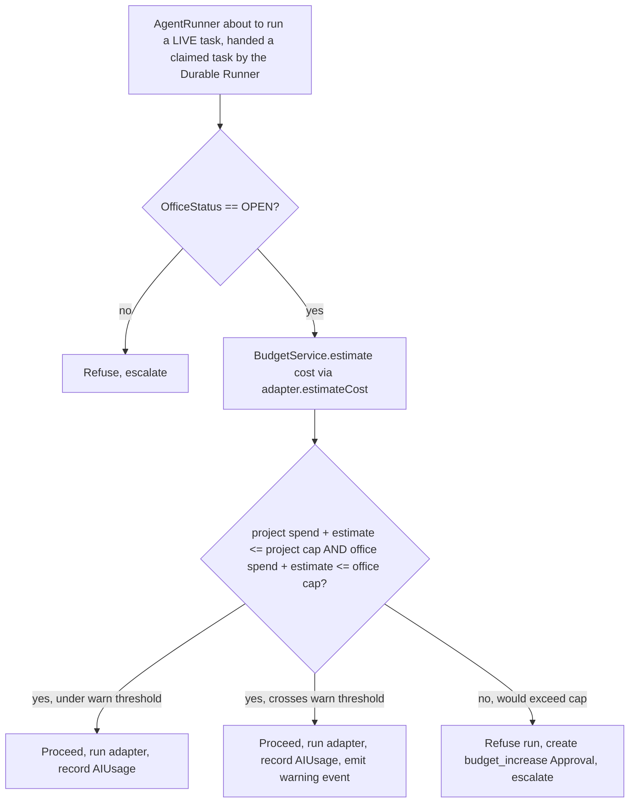

# 09 — Budget & Cost Controls

## 1. Targets

- **Office-level hard cap: $30/month** (brief's stated target, seeded as
  the default `budget_records` row, scope=`office`).
- **Per-project cap**: optional, owner-settable, defaults to unset
  (= bounded only by the office cap).
- **Idle cost target: $0.** No AI spend occurs unless the owner actively
  starts/advances a LIVE-mode agent run while the Office is `OPEN`.

## 2. Enforcement point (the actual gate, not just a dashboard number)

All budget enforcement happens in one place: `BudgetService.authorize()`,
called by `AgentRunner` **before** invoking any non-simulated
`AIProviderAdapter`. This is a hard architectural rule: no code path
outside `AgentRunner` is allowed to call a live provider adapter
directly (enforced by code organization — adapters are only imported
inside `lib/ai-office/agents/agent-runner.ts` — and confirmed by a test
in [10-testing-strategy.md](./10-testing-strategy.md)).

This rule holds regardless of *what* triggers `AgentRunner` — whether
that's the Durable Local Execution Runner's poll loop claiming a task
in the normal flow (Phase 5+, see
[03-system-architecture.md](./03-system-architecture.md) §9), or (Phase
7) a real Claude-backed run. The Durable Runner claims a task and hands
it to `AgentRunner`; it never talks to a provider adapter itself. Adding
a live provider in Phase 7 therefore cannot bypass this gate by
construction — there is no second entry point into provider execution
for it to use.

`estimateCost()` (part of the `AIProviderAdapter` interface, see
[04-agent-architecture.md](./04-agent-architecture.md) §4) is called
*before* spending anything, so a task that would blow the budget is
refused pre-emptively rather than discovered after the fact.

## 3. Cost tracking granularity

- **Per agent run**: `ai_usage` row — input/output tokens, `costUsd`.
  Simulated runs write a row with `costUsd = 0` too, so the activity
  feed and reporting UI behave identically in both modes (no special-
  casing "simulated rows don't count" logic scattered through the UI).
- **Per task**: sum of its `task_attempts` → `agent_runs` → `ai_usage`.
- **Per project**: sum of all its tasks' usage — shown on the project
  detail page.
- **Per month (office)**: sum of all projects' usage within
  `budget_records.periodStart`'s month — shown on the dashboard.

## 4. Warnings

- Configurable percentages (default 50% and 80%) on both office and
  project scope (`budget_records.warnAtPercent`).
- Crossing a threshold emits a `messages_events` row (visible in the
  activity feed) and surfaces a dashboard banner — does **not** block
  the run, only the hard cap (§2, `D -->|no|`) blocks.

## 5. Hard limit behavior

Reaching 100% of either the project cap or the office cap:
- Blocks any further LIVE agent run (SIMULATED runs are unaffected — see
  §7).
- Creates a `budget_increase` `Approval` (see
  [08-security-plan.md](./08-security-plan.md) §9) — the *only* way past
  the hard limit is an explicit owner approval that raises the cap; there
  is no silent override.
- The affected project moves to `BLOCKED` if it has no further non-AI
  work it can do; the Office itself is unaffected (other projects under
  their own caps continue).

## 6. Office open/closed and cost

- `CLOSE OFFICE` → the Durable Runner's poll loop stops claiming
  anything on its very next cycle (see
  [03-system-architecture.md](./03-system-architecture.md) §9.5), and
  `AgentRunner`'s own office-status check (§2, first gate) is a second,
  redundant check at execution time — a closed Office has **zero**
  possible new AI spend by construction, checked at two independent
  points, not by convention.
- Reopening does not retroactively run anything skipped — the Durable
  Runner simply resumes normal claim-and-execute on its next poll cycle
  from saved state; no owner action beyond "Open Office" is needed to
  restart dispatch.
- The brief's caveat — "do not assume external consumer subscriptions
  such as Claude or ChatGPT can automatically be paused by this
  application" — is respected: this system only controls *its own* API
  calls (pay-per-use API billing), never a separate consumer subscription
  Raviteja might also hold. That distinction is documented here so it's
  never silently assumed away in a future phase.

## 7. Simulated mode and cost

`SimulatedAdapter.estimateCost()` always returns `$0`, and
`BudgetService.authorize()` for a `SIMULATED`-mode project **skips the
cap check entirely** (there's nothing to cap) but still records a `$0`
`ai_usage` row — this is what lets the full Phase 4 acceptance scenario
(idea → ... → approval, per
[05-orchestration-workflow.md](./05-orchestration-workflow.md) §3.1) run
and be re-run freely with zero budget risk, while still exercising every
piece of the budget *reporting* UI honestly (it shows real rows, just at
$0).

## 8. Provider cost accuracy

`AIProviderAdapter.runAgentTask()` results include `usage` (§ agent
architecture doc) sourced from the **provider's own reported usage**
(e.g. Claude API's token counts in the response), converted to USD via a
small, explicit pricing table kept in
`lib/ai-office/providers/pricing.ts` — not estimated from prompt length
heuristics once a real provider is wired up. That pricing table is a
maintenance point flagged in
[13-risk-register.md](./13-risk-register.md) (model prices change).

## 9. What is explicitly out of scope for budget controls

- No automatic downgrade to a cheaper model on threshold breach — a hard
  stop plus an owner approval is simpler and safer than an autonomous
  "spend differently" decision for a $30/month personal budget.
- No prepaid-credit/wallet system — the cap is a spend ceiling checked
  against actual provider billing usage, not a separate currency to
  manage.
- No per-role budget sub-allocation (e.g. "QA gets $5, Architect gets
  $10") in the initial design — unnecessary complexity at this scale;
  office/project scoping is sufficient. Flagged as a possible future
  refinement only if real usage data shows one role dominating spend
  unexpectedly.
